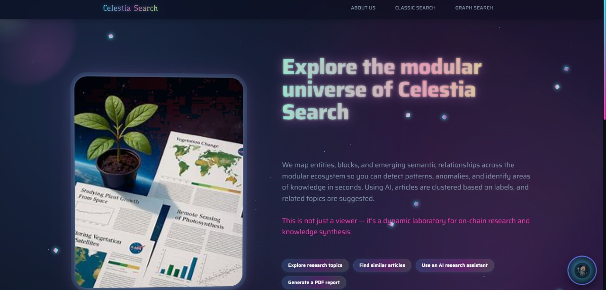
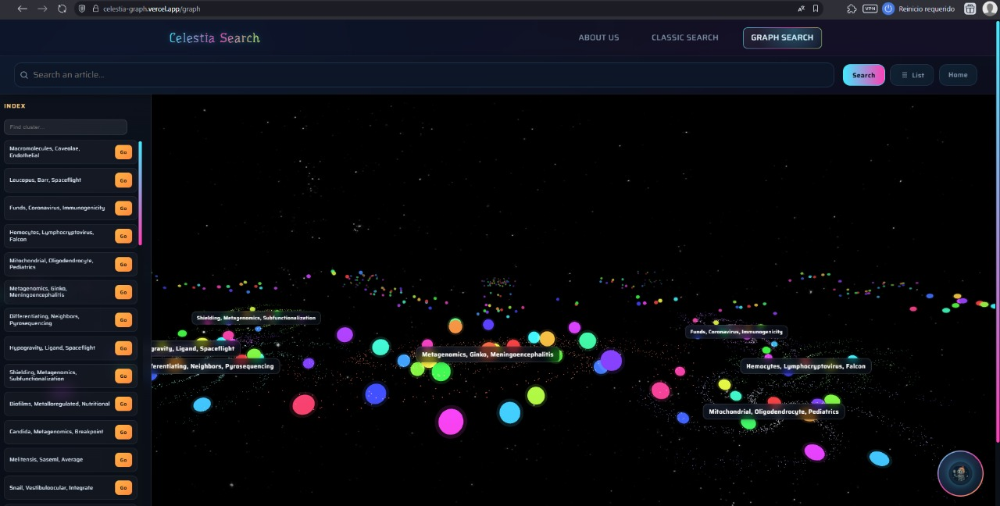
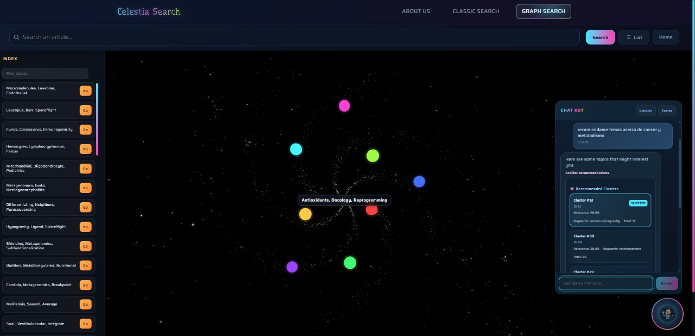

# CelestiaGraph

This project provides a 3D interactive platform for exploring scientific literature through galaxy visualizations. Built with React, TypeScript, and Three.js for the NASA Space Apps Challenge 2024.

## Features

The application transforms academic research papers into navigable 3D space environments:

- **3D Universe Visualization** - Interactive galaxies represent research clusters with real-time particle rendering using Three.js
- **Article Detail View** - Concentric ring system displays article references and similar papers with enriched metadata
- **Advanced Search Interface** - Filter articles by year, citations, keywords, and clusters with Semantic Scholar integration
- **AI-Powered ChatBot** - Natural language assistant for article recommendations and navigation
- **Collection Management** - Persistent cart system with export capabilities (PDF, CSV, JSON)

## Getting Started

Clone the repository and install dependencies:

```bash
git clone https://github.com/dev1d123/CelestiaGraph.git
cd CelestiaGraph/celestia-graph
npm install
```

Start the development server:

```bash
npm run dev
```

The application will be available at `http://localhost:5173`

## Screenshots

### Home Page

The landing page introduces the platform with feature highlights and navigation options.



### 3D Universe View (Clusters)

Interactive galaxy visualization showing research clusters in 3D space. Each galaxy represents a thematic cluster of papers.



### Article Detail Page

Detailed view of a specific article with concentric rings displaying references and similar papers.


### AI ChatBot Assistant

The integrated chatbot provides intelligent recommendations and answers questions about articles and research topics.



## Available Scripts

```bash
npm run dev      # Start development server with HMR
npm run build    # Build for production
npm run preview  # Preview production build locally
npm run lint     # Run ESLint on all files
```

## Navigation Controls

The 3D universe view supports the following interactions:

| Action | Input |
|--------|-------|
| Rotate camera | Left mouse button + drag |
| Pan view | Right mouse button + drag |
| Zoom in/out | Mouse wheel scroll |
| Focus on cluster | Click on galaxy |

## Technology Stack

This project is built with:

- [React 19.1](https://react.dev/) - UI framework with concurrent features
- [TypeScript 5.9](https://www.typescriptlang.org/) - Type-safe JavaScript
- [Vite 7.1](https://vitejs.dev/) - Fast build tool and dev server
- [Three.js 0.180](https://threejs.org/) - WebGL 3D graphics library
- [React Router 7.6](https://reactrouter.com/) - Client-side routing
- [Axios 1.12](https://axios-http.com/) - HTTP client
- [jsPDF 3.0](https://github.com/parallax/jsPDF) - PDF generation

## Project Structure

```
celestia-graph/
├── public/
│   └── img/                # Static image assets
├── src/
│   ├── components/         # Reusable UI components
│   │   ├── ChatBotWidget.tsx
│   │   ├── GraphNavBar.tsx
│   │   └── NavBar.tsx
│   ├── pages/              # Route-level components
│   │   ├── HomePage.tsx
│   │   ├── GraphPage.tsx
│   │   ├── GraphSunPage.tsx
│   │   ├── ClassicalPage.tsx
│   │   ├── AboutPage.tsx
│   │   └── CartPage.tsx
│   ├── three/              # Three.js components
│   │   ├── Universe.tsx
│   │   ├── RingsGraph.tsx
│   │   └── Galaxy.tsx
│   ├── services/
│   │   └── ApiService.tsx  # API client with abort support
│   ├── context/
│   │   └── CartContext.tsx # Global state management
│   ├── router/
│   │   └── AppRouter.tsx   # Route definitions
│   └── styles/             # Global CSS
├── package.json
├── tsconfig.json
└── vite.config.ts
```

## Performance Optimization

The application implements several optimization techniques:

- **Level of Detail (LOD)** - Reduces particle count for distant galaxies
- **View Frustum Culling** - Hides objects outside camera view
- **Request Cancellation** - Aborts pending API calls on navigation
- **Lazy Loading** - Code-splitting for route components
- **Caching Strategy** - LocalStorage for chat history and camera state

## API Integration

The platform connects to multiple backend services:

```typescript
// Cluster service endpoints
GET /combined-groups           # Fetch all research clusters
GET /cluster/:id              # Get specific cluster data
GET /cluster/:id/labels       # Retrieve cluster keywords

// Chat service
POST /chat                    # Send message to AI assistant

// External metadata (Semantic Scholar)
GET /paper/:corpusId          # Fetch article metadata
```

## Building for Production

Create an optimized production build:

```bash
npm run build
```

The build output will be in the `dist/` directory. Deploy to any static hosting service:

- [Vercel](https://vercel.com/)
- [Netlify](https://www.netlify.com/)
- [GitHub Pages](https://pages.github.com/)
- AWS S3 + CloudFront
- Docker + Nginx
